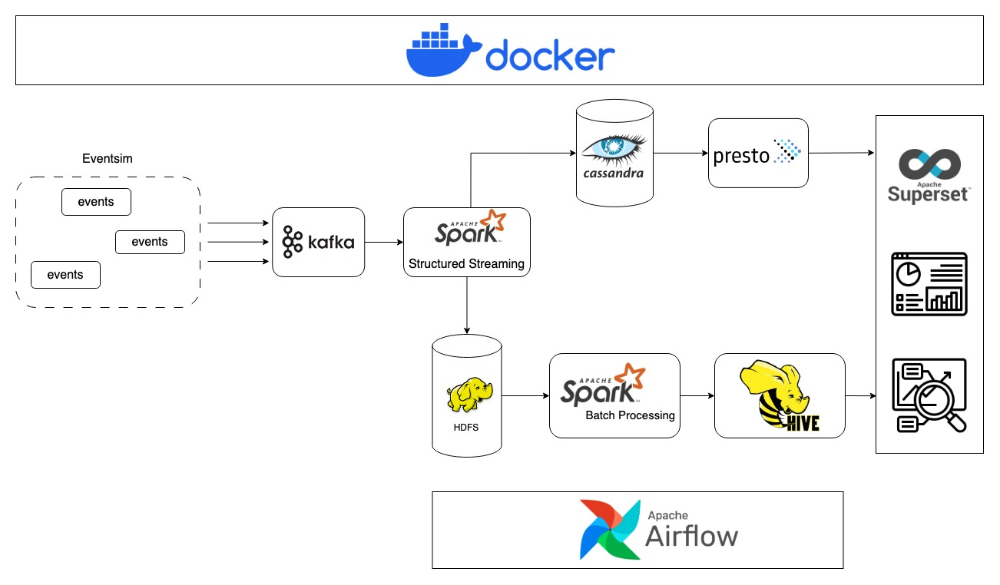
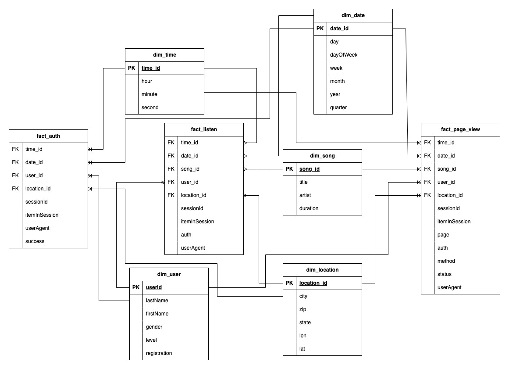
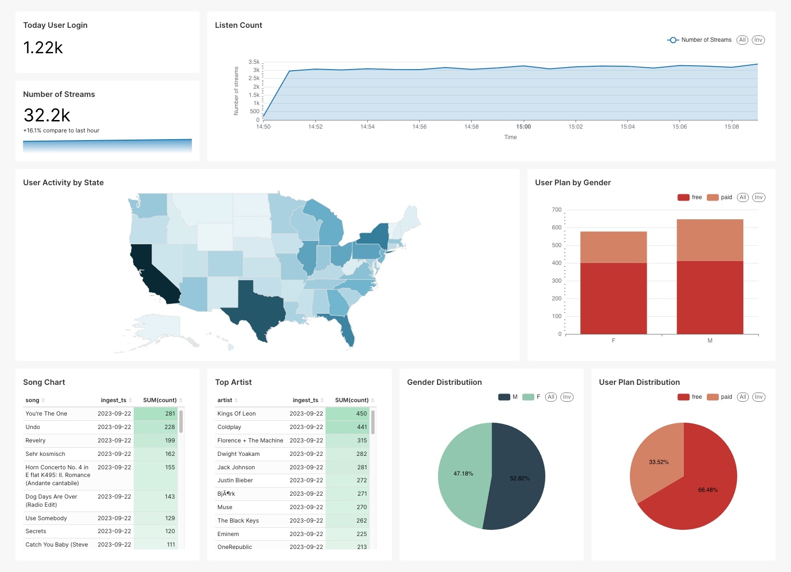

# **Music Event Data Pipeline**
## **Overview**
The main purpose of the project is building a data pipeline which is using various tools for processing data such as Kafka, Spark, Airflow, Hadoop, etc. 

This project is building a data pipeline to process events sent from fake music streaming platform. The data would be processed through Lambda Architecture for both batch and streaming data. The project broken down into multiple micro services mantained by docker containers to be easily manageable.
**Notice**: This project built on arm64 architecture. If you want to run on your machine which has different architect from arm64 - amd64 for instance, you can checkout the following changes:
- airflow/Dockerfile: change JAVA HOME directory
## **Tools & Technology**
- Hadoop
- Docker
- Apache Spark
- Apache Kafka
- Cassandra
- Hive
- Apache Airflow
- Apache Superset
- Language: Python

## **Data**
[Eventsim](https://github.com/Interana/eventsim) is the main data sources being used to generates events that simulates from a music streaming platform. The generated data based on user interaction on pages, user authentication and user listening events. 

## **Architecture**
Lamda architecture is used to handle for both real time events visualization and data analysis from batch data events. Docker containerize all the services which are available in this project to make them organizable and manageable. The architecture diagram is show below:



### **ETL flow**:
The generated data is sent to Kafka. Lamda architecture is used to handle for both streaming process and batch process.
#### **Streaming Process**: 
Data is extracted, transformed following specific purposes of visualization and stored in Cassandra for every minute. Presto is an intermediate distributed query engine for superset to interact with Cassandra.

#### **Batch Process**: 
Data is extracted, partitioned by date and stored in Hadoop HDFS, transformed to **Star Schema**  and stored in Hive dataware house for Data Analysis to answer following questions:
* "How many users that logged in?" in different granularity such as minute, second, hour, day, week, month, year.
* "What is the top songs, artists?" in different granularity: minute, second, hour, day, week, month, year.
* "What is the most location that listen on the platform the most?" in different granularity.
* How many songs that has been played? in differnt granularity: minute, second, hour, day, week, month, year.
* What is distribution of users based on genders, level?
* What is average number of songs listened by users?
* etc.

#### Star Schema:
The schema includes:
* Fact tables:
    * fact_listen
    * fact_auth
    * fact_page_view
* Dimension tables:
    * dim_time
    * dim_date
    * dim_user
    * dim_song
    * dim_location

All dimension tables are conformed dimension which are used for multiple fact tables.

The data model diagram is shown as below:



Orchestration:
Airflow is used to schedule, trigger 2 DAGs in this project:
* Full load DAG is scheduled in the first run of the project, data before the current day will be processed and load to data warehouse.
* Incremental load DAG is scheduled to run daily at the midnight to process and store new data to data warehouse.

## **Dashboard**

Example:



## **Setup & Deployment**

### Prerequisites
- Docker

### Setup
I prepared few scripts to setup and start the project automatically. In order to setup this project, the following steps are required for the project to be successfully executed.

* Firstly, you need to gain permission for shell scripts by using the following command:
    ```
    chmod +x *.sh
    ```

* Then run the following command to setup required images and containers:
    ```
    ./setup.sh
    ```
    This function is downloading/buidling required images, then creating containers for services used in this project. </br>
    
    **Warning:** Because there are bunch of containers is going to be created, make sure you have enough available memory on your computer to successfully startup these containers.

* In order to start processing streaming and batch events, use this script:
    ```
    ./startup.sh
    ```
    This script create ETL pipeline for processing streaming and batch data.

* To shut down the project, use this command:
    ```
    ./shutdown.sh
    ```

* Running services can be directly accessible at following these sites:
    * Spark Web UI: http://localhost:8080
    * HDFS Web UI: http://localhost:9870
    * Airflow Web Server: http://localhost:8083
        * username: airflow
        * password: airflow
    * Superset Web UI: http://localhost:8089
        * username: admin
        * password: admin
    * Presto: http://localhost:8082